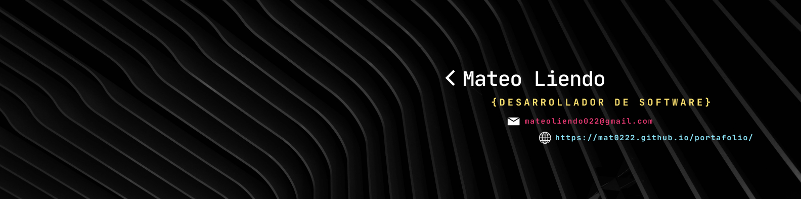

<!-- Banner -->

  

# 👋 ¡Hola! Soy Mateo Liendo  

💻 **Frontend Developer** apasionado por crear interfaces modernas y funcionales.  
🚀 Me gusta aprender nuevas tecnologías y llevar proyectos de idea a producción.  

---

## 🚀 Proyectos destacados

### 1. [Sistema Administrativo](https://github.com/mat0222/bicicleteria)
Sistema de Administracion donde el usuario puede agregar, borrar y editar sus productos.  
**Tecnologías:** HTML, CSS, JavaScript, PHP  
**Demo:** https://mat0222.github.io/bicicleteria/  

### 2. [Simulador Futbol Manager](https://github.com/mat0222/Futmania)
Simulador para sentirte todo un Manager de futbol profesional.  
**Tecnologías:** Html, CSS, Java Script, MySQL  
**Demo:** https://mat0222.github.io/Futmania/  

### 3. [Simulador E.Commerce](https://github.com/mat0222/funko-shop)
Simulador de compras donde puedes escojer tu Funko POP con un sistema de tarjeta y recibo.  
**Tecnologías:** Html, CSS, Java Script  
**Demo:** https://mat0222.github.io/funko-shop/ 

---

## 🛠️ Lenguajes y herramientas

---

## 📊 Estadísticas de GitHub

  
  

---

## 📬 Conectemos

  
  
  

---

⭐ Si te gusta mi trabajo, ¡no dudes en dejar un star en mis repositorios!  

